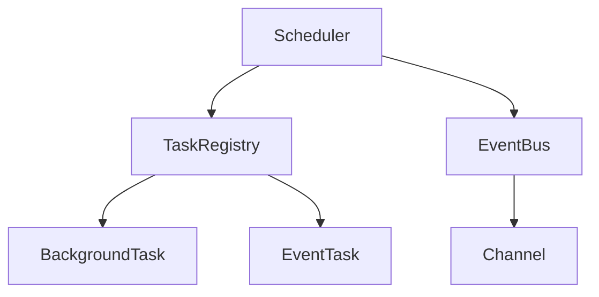
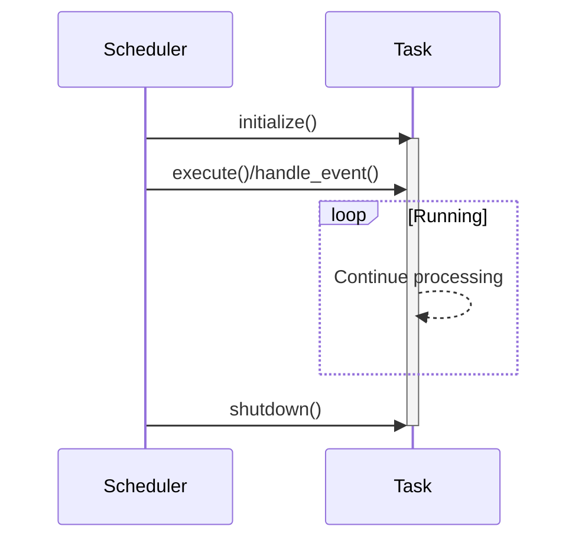

# Task Orchestrator Implementation Document

## Architecture Overview



## Core Components

### 1. Scheduler Struct
```rust
pub struct Scheduler<E> {
    task_registry: TaskRegistry<E>,
    background_task_ids: Vec<TaskId>,
    event_task_ids: Vec<TaskId>,
    event_bus: EventBus<E>,
}
```
- Task lifecycle management (start/stop)
- Event bus management
- Task registration/retrieval

#### Key Methods:
- `start()`: Initialize and start all tasks
- `shutdown()`: Graceful shutdown of all tasks
- `register_background_task()`: Register background task
- `register_event_task()`: Register event-driven task

### 2. TaskRegistry
- Central task registration/management component
- Generic type `E` for event type management
- Thread-safe task storage using `Arc<Mutex<T>>`

### 3. EventBus
```rust
pub struct EventBus<E> {
    channels: HashMap<E, broadcast::Sender<String>>,
    configs: Vec<ChannelConfig>,
}
```
- Event channel configuration management
- Efficient message delivery via broadcast
- Configurable capacity per channel

## Task Lifecycle



## Event System Details

### Event Processing Flow
1. Event publication: `EventBus::clone_sender()`
2. Event subscription: `EventBus::subscribe()`
3. Message delivery: `broadcast::Sender<String>`
4. Event handling: `EventTask::handle_event()`

### Channel Configuration
```rust
pub struct ChannelConfig {
    pub capacity: usize,     // Message queue capacity
    pub description: String, // Channel description
}
```

## Error Handling

`SchedulerError` Enum:
```rust
#[derive(Error, Debug)]
pub enum SchedulerError {
    #[error("Task initialization error: {0}")]
    TaskInitialization(String),
    #[error("Task execution error: {0}")]
    TaskExecution(String),
    #[error("Task shutdown error: {0}")]
    TaskShutdown(String),
    #[error("Invalid channel: {0}")]
    InvalidChannel(String),
    #[error("Event send error: {0}")]
    EventSend(String),
    #[error("Event receive error: {0}")]
    EventReceive(String),
    #[error("Task not found: {0}")]
    TaskNotFound(TaskId),
}
```

## Usage Examples

### Background Task Implementation
```rust
struct BackgroundProcessor {
    name: String,
    status: Arc<Mutex<ExecutionStatus>>,
}

#[async_trait]
impl BackgroundTask for BackgroundProcessor {
    async fn execute(&mut self) -> Result<(), SchedulerError> {
        // Background processing
        tokio::time::sleep(Duration::from_secs(1)).await;
        Ok(())
    }
}
```

### Event-Driven Task Implementation
```rust
struct EventProcessor {
    event: TestEvent,
    received_events: Arc<Mutex<Vec<String>>>,
}

#[async_trait]
impl EventTask<TestEvent> for EventProcessor {
    fn subscribed_event(&self) -> &TestEvent {
        &self.event
    }

    async fn handle_event(&mut self, event: String) -> Result<(), SchedulerError> {
        self.received_events.lock().await.push(event);
        Ok(())
    }
}
```

## Testing Strategy
- Task lifecycle validation (init/execute/shutdown)
- Event delivery accuracy verification
- Edge case testing (capacity overflow/invalid channel access)
- Thread safety verification under concurrent execution
- Comprehensive error handling tests
