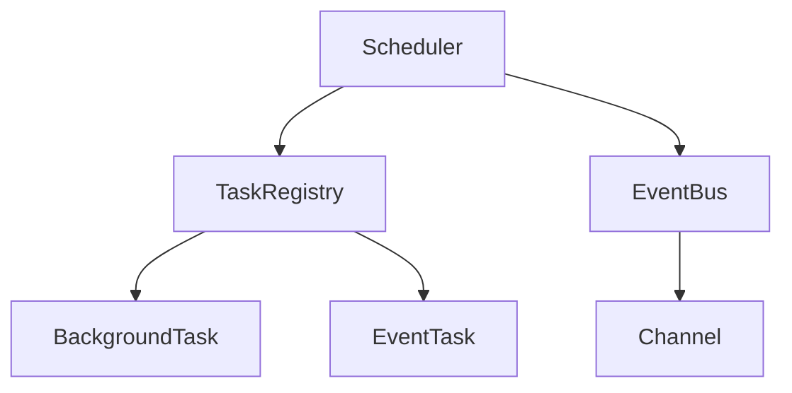
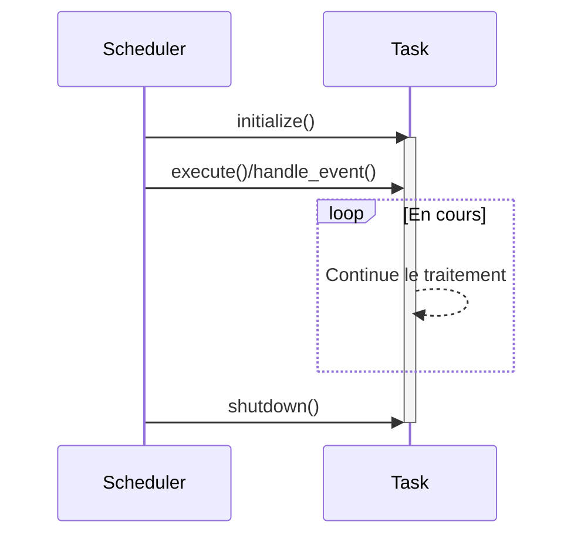

# Document d'Implémentation de l'Orchestrateur de Tâches

## Vue d'ensemble de l'architecture



## Composants Principaux

### 1. Structure Scheduler
```rust
pub struct Scheduler<E> {
    task_registry: TaskRegistry<E>,
    background_task_ids: Vec<TaskId>,
    event_task_ids: Vec<TaskId>,
    event_bus: EventBus<E>,
}
```
- Gestion du cycle de vie des tâches (démarrage/arrêt)
- Gestion du bus d'événements
- Enregistrement/récupération des tâches

#### Méthodes Clés :
- `start()`: Initialise et démarre toutes les tâches
- `shutdown()`: Arrêt gracieux de toutes les tâches
- `register_background_task()`: Enregistre une tâche en arrière-plan
- `register_event_task()`: Enregistre une tâche pilotée par événements

### 2. TaskRegistry
- Composant central d'enregistrement/gestion des tâches
- Type générique `E` pour la gestion des types d'événements
- Stockage thread-safe utilisant `Arc<Mutex<T>>`

### 3. EventBus
```rust
pub struct EventBus<E> {
    channels: HashMap<E, broadcast::Sender<String>>,
    configs: Vec<ChannelConfig>,
}
```
- Gestion de la configuration des canaux d'événements
- Livraison efficace des messages via broadcast
- Capacité configurable par canal

## Cycle de Vie des Tâches



## Détails du Système d'Événements

### Flux de Traitement des Événements
1. Publication d'événement : `EventBus::clone_sender()`
2. Abonnement aux événements : `EventBus::subscribe()`
3. Livraison du message : `broadcast::Sender<String>`
4. Gestion de l'événement : `EventTask::handle_event()`

### Configuration des Canaux
```rust
pub struct ChannelConfig {
    pub capacity: usize,     // Capacité de la file de messages
    pub description: String, // Description du canal
}
```

## Gestion des Erreurs

Énumération `SchedulerError` :
```rust
#[derive(Error, Debug)]
pub enum SchedulerError {
    #[error("Erreur d'initialisation de tâche : {0}")]
    TaskInitialization(String),
    #[error("Erreur d'exécution de tâche : {0}")]
    TaskExecution(String),
    #[error("Erreur d'arrêt de tâche : {0}")]
    TaskShutdown(String),
    #[error("Canal invalide : {0}")]
    InvalidChannel(String),
    #[error("Erreur d'envoi d'événement : {0}")]
    EventSend(String),
    #[error("Erreur de réception d'événement : {0}")]
    EventReceive(String),
    #[error("Tâche introuvable : {0}")]
    TaskNotFound(TaskId),
}
```

## Exemples d'Utilisation

### Implémentation d'une Tâche en Arrière-plan
```rust
struct BackgroundProcessor {
    name: String,
    status: Arc<Mutex<ExecutionStatus>>,
}

#[async_trait]
impl BackgroundTask for BackgroundProcessor {
    async fn execute(&mut self) -> Result<(), SchedulerError> {
        // Traitement en arrière-plan
        tokio::time::sleep(Duration::from_secs(1)).await;
        Ok(())
    }
}
```

### Implémentation d'une Tâche Pilotée par Événements
```rust
struct EventProcessor {
    event: TestEvent,
    received_events: Arc<Mutex<Vec<String>>>,
}

#[async_trait]
impl EventTask<TestEvent> for EventProcessor {
    fn subscribed_event(&self) -> &TestEvent {
        &self.event
    }

    async fn handle_event(&mut self, event: String) -> Result<(), SchedulerError> {
        self.received_events.lock().await.push(event);
        Ok(())
    }
}
```

## Stratégie de Test
- Validation du cycle de vie des tâches (init/execute/shutdown)
- Vérification de la précision de la livraison des événements
- Tests des cas limites (débordement de capacité/accès à un canal invalide)
- Vérification de la sécurité des threads lors d'exécutions concurrentes
- Tests complets de la gestion des erreurs
