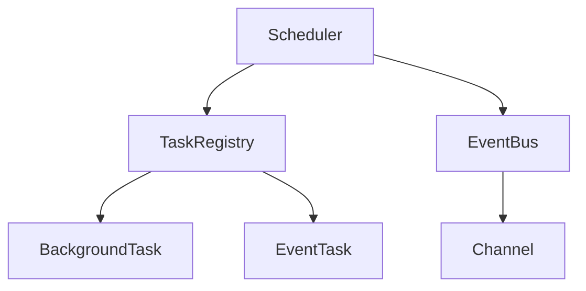
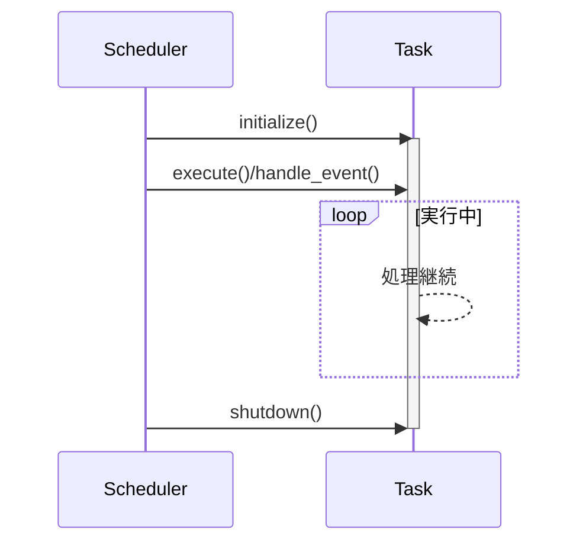

# タスクオーケストレータ 実装ドキュメント

## アーキテクチャ概要



## コアコンポーネント

### 1. Scheduler構造体
```rust
pub struct Scheduler<E> {
    task_registry: TaskRegistry<E>,
    background_task_ids: Vec<TaskId>,
    event_task_ids: Vec<TaskId>,
    event_bus: EventBus<E>,
}
```
- タスクのライフサイクル管理（起動/停止）
- イベントバスの管理
- タスクの登録・取得機能

#### 主要メソッド:
- `start()`: 全タスクの初期化と実行開始
- `shutdown()`: 全タスクの正常終了処理
- `register_background_task()`: バックグラウンドタスク登録
- `register_event_task()`: イベント駆動タスク登録

### 2. TaskRegistry
- タスクの登録・管理を行うコンポーネント
- ジェネリック型`E`でイベントタイプを管理
- スレッドセーフなタスク保存に`Arc<Mutex<T>>`を採用

### 3. EventBus
```rust
pub struct EventBus<E> {
    channels: HashMap<E, broadcast::Sender<String>>,
    configs: Vec<ChannelConfig>,
}
```
- イベントチャンネルの設定管理
- ブロードキャスト通信による効率的なメッセージ配信
- チャンネルごとの容量設定可能

## タスクライフサイクル



## イベントシステム詳細

### イベント処理フロー
1. イベント発行: `EventBus::clone_sender()`
2. イベント購読: `EventBus::subscribe()`
3. メッセージ配送: `broadcast::Sender<String>`
4. イベント処理: `EventTask::handle_event()`

### チャンネル設定
```rust
pub struct ChannelConfig {
    pub capacity: usize,     // メッセージキュー容量
    pub description: String, // チャンネル説明文
}
```

## エラーハンドリング

`SchedulerError`列挙型:
```rust
#[derive(Error, Debug)]
pub enum SchedulerError {
    #[error("タスク初期化エラー: {0}")]
    TaskInitialization(String),
    #[error("タスク実行エラー: {0}")]
    TaskExecution(String),
    #[error("タスク停止エラー: {0}")]
    TaskShutdown(String),
    #[error("無効なチャンネル: {0}")]
    InvalidChannel(String),
    #[error("イベント送信エラー: {0}")]
    EventSend(String),
    #[error("イベント受信エラー: {0}")]
    EventReceive(String),
    #[error("タスクが見つかりません: {0}")]
    TaskNotFound(TaskId),
}
```

## 使用例

### バックグラウンドタスク実装
```rust
struct BackgroundProcessor {
    name: String,
    status: Arc<Mutex<ExecutionStatus>>,
}

#[async_trait]
impl BackgroundTask for BackgroundProcessor {
    async fn execute(&mut self) -> Result<(), SchedulerError> {
        // バックグラウンド処理
        tokio::time::sleep(Duration::from_secs(1)).await;
        Ok(())
    }
}
```

### イベント駆動タスク実装
```rust
struct EventProcessor {
    event: TestEvent,
    received_events: Arc<Mutex<Vec<String>>>,
}

#[async_trait]
impl EventTask<TestEvent> for EventProcessor {
    fn subscribed_event(&self) -> &TestEvent {
        &self.event
    }

    async fn handle_event(&mut self, event: String) -> Result<(), SchedulerError> {
        self.received_events.lock().await.push(event);
        Ok(())
    }
}
```

## テスト戦略
- タスクライフサイクル検証（初期化・実行・停止）
- イベント配送の正確性検証
- エッジケーステスト（容量超過・無効チャンネルアクセス）
- 並行実行時のスレッド安全性検証
- エラーハンドリングの網羅的テスト

````
